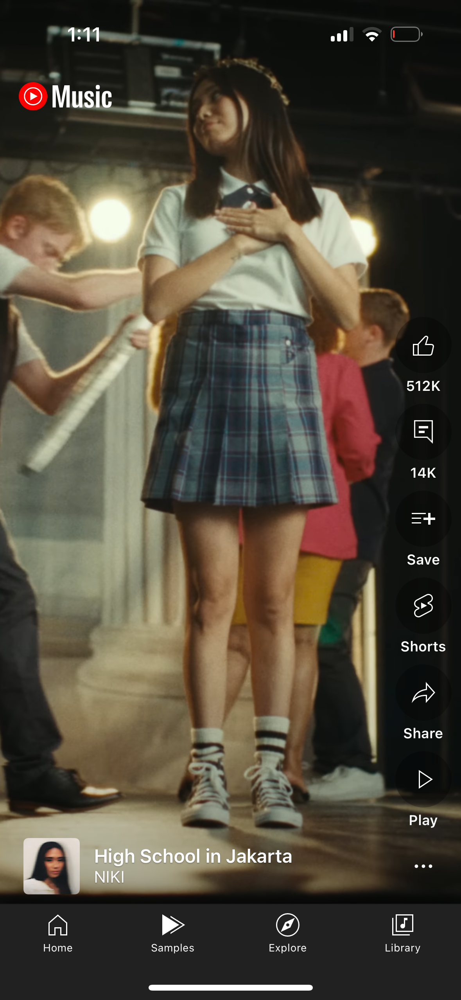
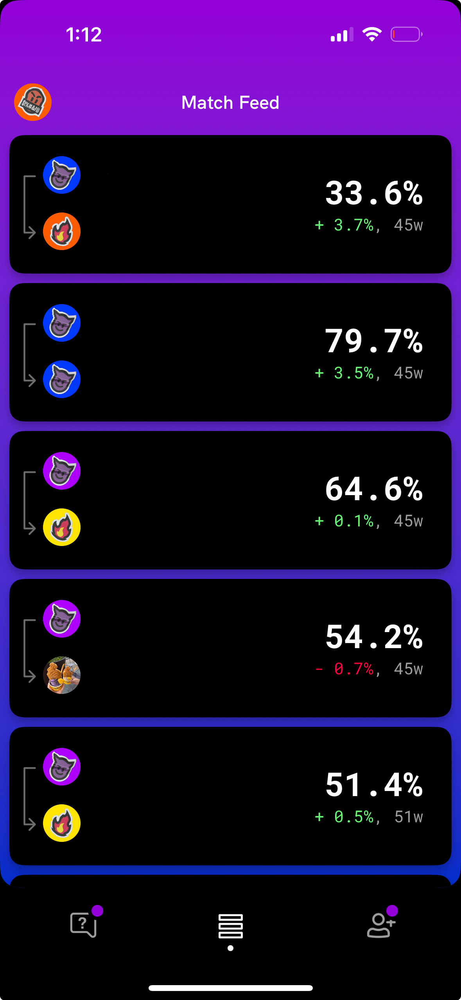
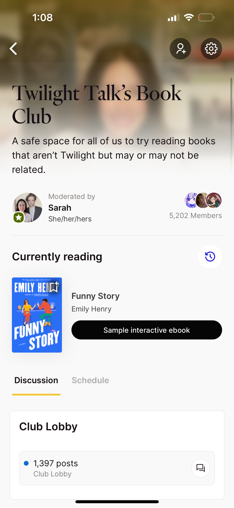
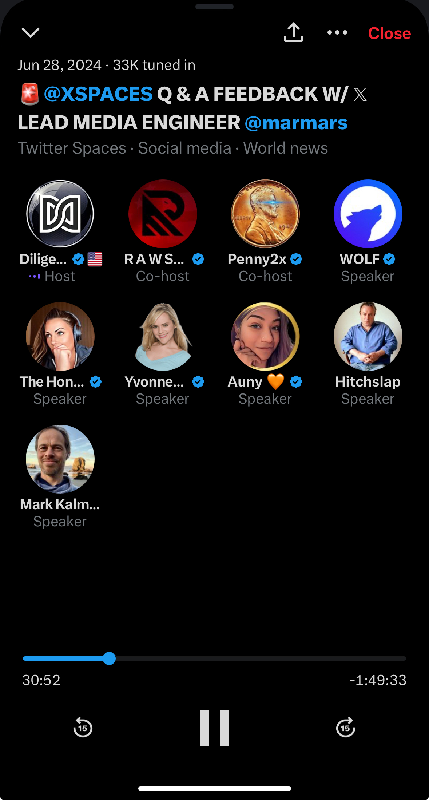
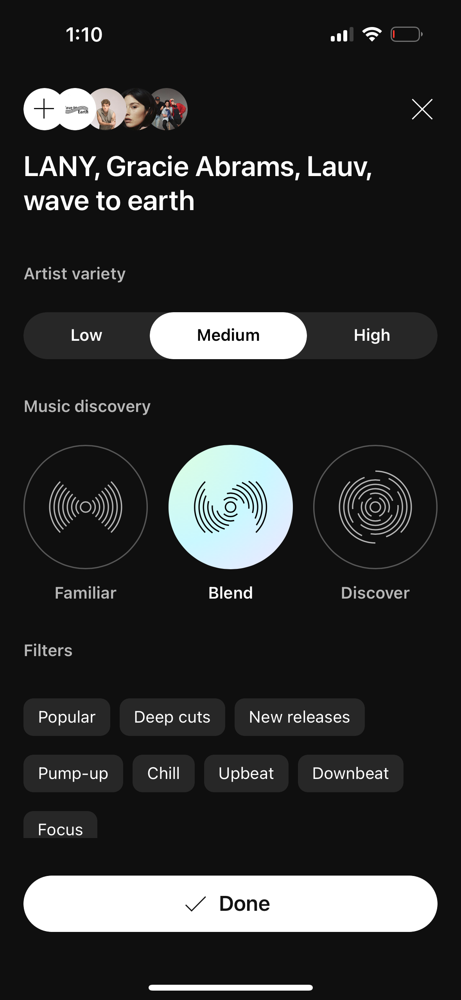
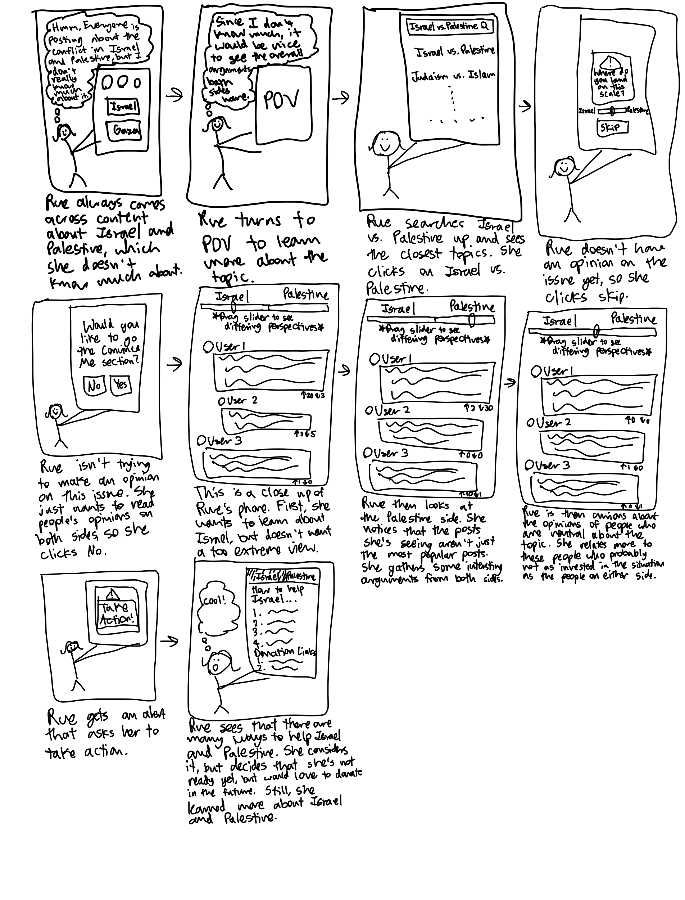
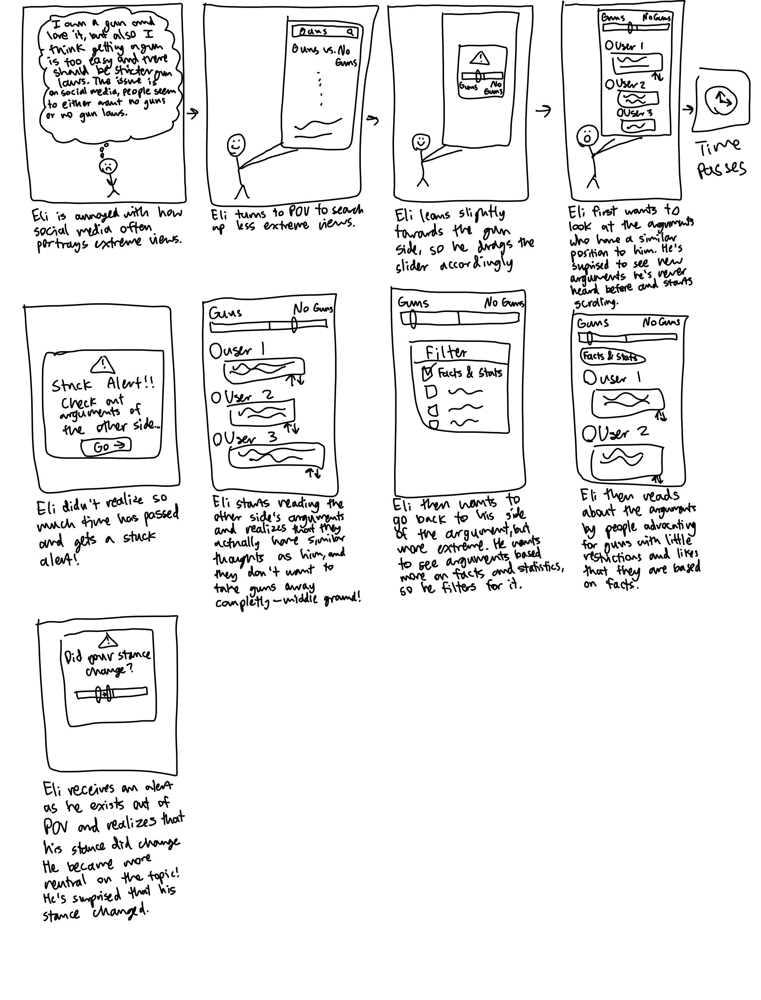

# Assignment 2: Divergent Thinking
#### Collaboration Partners: Tiana Jiang, ChatGPT
## Goals
**Name:** POV

**Audience:** POV is designed for people frustrated by social media algorithms that reinforce echo chambers and prioritize extreme content. It's for people who seek diverse perspectives, thoughtful discussions, and the ability to engage with people from differing viewpoints.

**Value:** Social media has become an echo chamber, surrounding users with content that mirrors their own views, while extreme opinions often go viral and misrepresent important issues. POV will change this by emphasizing exposure to opposing viewpoints and new topics, using an algorithm that balances unpopular and popular posts to highlight non-extreme perspectives and a variety of opinions.

## Scrapbook of Comparables
{:width="300"}

Youtube music has a samples tab, which shows the user quick previews of new music. We can have a similar tab that previews posts. Maybe we can incorporate something so that people can see content purely based on the text to counteract biases.

{:width="300"}

Checkmate is an app that makes users answer questions everyday to see how compatible users are to their friends. We can do a similar thing but invert the score to be how not compatible you are.

{:width="300"}

Fable has book clubs that read and comment on books together. This can be extended to POV by having communities that complete tasks together.

{:width="300"}

Twitter/X has live talks called Spaces where pannels can be hosted in real time and have other people listening in. This would be good to have in POV for real time discussions. It could be used for debates or discussions with a larger group of people on opposing sides.

{:width="300"}

Youtube music allows users to create radios, which generates a bunch of music based on criteria that users choose. This could be used to tailor content to a user's specifications.

## Features
- Informed Stance: Although users can choose their stance on issues right away, they can also decide not to choose right away. After the user reads a certain numbers of posts and comments on the topic, they will receive an alert that asks them whether they have a stance now. This gives users a chance to explore different opinions before making a choice if they were unsure before. For users who have chosen their stance from the beginning, it can be time of sel reflection to see if they have changed their opinion.
- Devil's Advocate: Users can choose to switch briefly to the mode "Devil's Advocate" where they can create a post or comment advocating for the opposing side. Furthermore, their post or comment will be tagged to show that it was made in "Devil's Advocate" mode. This encourages users to actively put themselves in the other side's shoes. 
- Viewpoint Spectrum: When people post their opinions to an issue, they can categorize their perspective on a draggable spectrum that ranges from strongly disagree to strongly agree. This would allow users to freely be able to express viewpoints that are more neutral and not extreme and show that their opinions aren't being forced into predefined categories.
- Stuck Alert: If the user is using most of their time to look at the same perspectives, they will get an alert that will limit the app's functionality to encourage the user to seek out new topics or new perspectives. This actively blocks people from being stuck in their own echo chamber, but that doesn't mean that they can't read posts and comments that are similar their views.
- Choose your own Adventure: People are given stories where they can select actions that are controversial in some way and then they can see how many people selected the option they picked. Many statistics about who chose what options can be shown. This introduces an entertaining aspect to the app while allowing users to reflect on their choices and what other users have chosen.
- Random Chamber: There is a tab in the app where posts and comments are shown at complete random, eliminating algorithms all together. The users can choose to also randomize the topics of the posts and comments to discover completely new content or remain in a topic they actively engage in, which would encourage them to explore new opinions on a topic they are invested in.
- Discovery Level: A level that keeps track of how much the user interacts with opposing views on topics and also whether they seek out new topics. This also keeps track of how their posts perform based on how many users like the post, emphasizing users from the opposing side.
- Convince Me: Users who don't know much about a topic can enter into the "Convince Me" section of the app where users can post an inquiry about a specific topic. Then, users with a high Discovery Level can add the most compelling argument for their side to it to try to convince the user who posted the post. This would uplift users who are unsure about their opinions on a topic.
- Non-Bias Samples: Users are shown summaries of people's posts that they can quickly swipe between and like the ones they find to be good. Also, there will be a twist where the posts will be stripped away of all information other than the text such as who the author is, how many likes the post currently has, and comments. This would allow people to form opinions that aren't based on popularity or other biases.
- Noncompatibility Score: We can either gather information of what the users post and look at most often or ask users to answer questions about controversial topics. We can then generate scores based on how different people's views from their friends and family using the data collected before. This would hopefully spark conversations between family and friends where people aren't just agreeing with each other the whole time.
- Learning Communities: The app can have communities of people with similar perspectives with the sole purpose of learning about the opposing perspectives and facts about the topic together. This motivates users to engage with diverse content and also educate themselves on several topics by doing it with other users.
- Live User Debates: We can host live talks with a moderator and two participants on opposing sides can debate around a pre-chosen topic. This can be expanded by allowing users who are listening in to be able to raise their hands and have the debate participants call on them to give their arguments and perspectives to the topic.
- Moody Content: Users can generate content based on how they're feeling or a genre of content they want to see such as silly topics or science topics. This allows users to still be able to see content they would be interested, while still leaving room for the app to push the user to discover and learn new things.
- Take Action: The app will give the option to users to see concrete actions on how to help an issue like donation links or petitions for putting into law. One of my interviewees didn't like that in a lot of social media, people are primarly focused on spreading awareness (which is still good) without including ways to make a direct impact.
- Anonymous Idea Draft: Users can submit hot takes or controversial ideas into the "Anonymous Idea Draft" where it can be anonymously critiqued and discussed by others holding diverse views. After feedback, users can choose to edit and post the idea or delete it. This allows people to throw out opinions that they might not necessarily be confident around and improve them with the help of others. This could help foster more interesting and niche arguments.
- Team Quiz: Users can take informational quizzes on various topics, and their individual scores will be combined with others who share the same stance. The collective score of their side is then compared against the aggregate score of users on the opposing side. This feature would encourage healthy competition that encourages users to learn important information about issues they're invested in.
- Question Prompts: The app can generate questions that create discussions within topics in the app and even have questions generate new and more topics. This allows people to focus their arguments for issues on specific questions and allows the discussion to continue, because it can be hard to come up with original content when given just the topic. It will also be good for generating new topics, because we want users to discover to new topics, which will be enhanced if there a lot of topics.
- Meme Corner: The app will have sections in each topic where people can add memes about the topic. This will be separate, so that if users don't want to see the memes, they can avoid it, and the app will encourage users to make educational memes, so people can learn from them in combination with humor.
- Perspective Tags: For posts or comments that users make, users can tag the post to categorize it. For example, one of the tags will be personal experiences and another tag will be Facts & Stats. This would encourage users to post arguments both motivated by personal experience and also by facts.
- Following Section: Users will be able to see a tab where they can see the posts and comments of the people they are following. Because this is a separate section, this allows users to interact with friends and family while still being able to explore other people's opinions. This would encourage users to keep strengthening personal connections.
- Challenge a Friend: Users can send challenges to other users to inspire users to send posts or comments or topics to their friends that they find particularly insightful or interesting. This allows users to share their opinions and further discuss diverse topics with other users based on the content of their challenge.

<!-- - Recaps of engagement every year
- friend can suggest something for you? challenge you to read on?
- in real life discussion
- NYT Games: easy able to get a format of your progress in a text form to share with other people
- Youtube: Categories of videos at top of page -> maybe people in mood for religion or controversial topics or more peacful things like people who like growing plants vs not or cats vs dogs
- Flo: educational videos/mini courses from experts?
- Reddit: filter comments by how controversial they are
- Slack: custom emojis for each worlspace
- Allow users to select a mode/end goal of app and tailer experiences to that
- new to you tab that always suggests a new topic you haven't seen before
- based on current events, we can push certain topics (like elections, olympics, covid)
- Locket: upload photos that shows up on the widget that people have on their phone home screens (maybe use for best opinion you've seen?)
- Randomizing the feed to show popular posts, but also unknown posts/comments (to balance popularity and extreme views)
- Polls to inspire opinions and thourhgts -> goes with questions
- Some sort of reward system to that users can give to each other that shows that people have "controversial" or "never thought of before" or other good characteristics
- Fact checking that links to the source and identifies whether the source is biased in some way (usually political)
- Tags for triggering topics to make sure people are safer
- Background Check:  something to do with people's backgrounds?? like match them with people with a very different backgorund or similar background but different views (community) -->

## VSD Analysis
- POV needs to be careful with children, especially because this app invites opinions on sensitive topics. Furthermore, very young kids are very easy to influence, so it would be best to direct the younger users to the Random chamber, which allows them to make their opinions mostly on their own. The Perspective Tags feature can include more tags specifically for triggering and serious topics, which could then not be shown on the feed of younger users.
- The Challenge a Friend feature could be abused by cultural and political groups by spamming users with posts that support their ideas. This could lead to several frustrations on all sides leading to increased tensions between different cultural and political groups. To help this, challenges can only be sent to users if the user being sent a challenge follows the user sending the challenge. It can also be limited, so users can only send challeneges once a day to force users to think more carefully about what challenges they want to me.
- POV encourages users to share opinions on serious topics, which can sometimes lead to backlash from friends or family and long-term damage to their relationship, especially on sensitive issues like sexuality or politics. This can be promoted by the Noncompatibility Score feature, which may expose people's opinions to their friends and family. To mitigate potential harm to relationships, we can allow users to choose to block certain topics from being used in their Noncompatibility Scores and also show their Compatibility Scores to encourage users to discuss and figure out differences and similarities with their friends and family.
- There is a value tension in the Team Quiz feature, because the purpose of the feature is to motivate people to become more informed, but this cause more animosity between the two sides of an issue. To minimize the negative affect, we can make sure to always give explanations for answer and link the sources to highlight the educational aspect of the quizzes. Additionally, we can allow users to form their own teams or even randomized teams instead of pre-determining the teams to be the two opposing sides of an issue.
- If the app grows to have millions of users, the ability to foster discussions with a smaller number of people diminishes. Small group discussion are valuable because it allows people to more easily connect with one another and makes people feel heard since their voices aren't drowned out. To foster this, we could extend the Learning Communities feature by also creating communities of randomized small groups of users who have very diverse perspectives.

## Storyboard Sketches
#### Rue is interested in the issues in Israel and Palestine, but doesn't know much about it.
{:width="600"}

#### Eli doesn't have an extreme opinon on gun rights, so he's fed up of only seeing the extreme views on social media.
{:width="600"}
