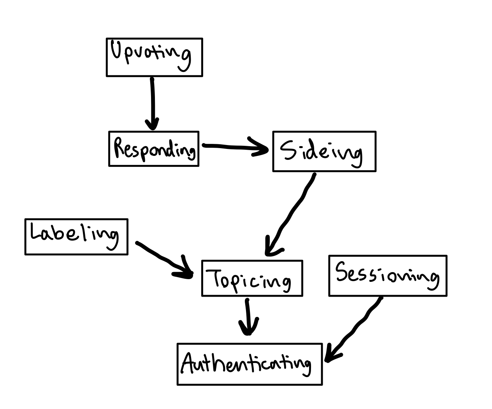

# Assignment 3: Convergent Design
#### Collaboration Partners: Tiana Jiang, ChatGPT
## Pitch
Introducing POV, a social media platform created for people tired of the echo chambers and polarization of social media today. POV is designed for those seeking meaningful conversations, diverse perspectives, and the opportunity to engage with differing viewpoints. Unlike traditional platforms that amplify extreme opinions, POV offers a space for balanced, thoughtful discussion without the overwhelming focus on popularity or virality.

POV offers key features to enhance this experience. With the Viewpoint Spectrum, users can express their stance on a topic along a gradient, capturing more nuanced opinions beyond a simple agree/disagree. The Devil’s Advocate mode lets users briefly advocate for the opposing side in responses, encouraging them to explore perspectives beyond their own. Another feature, Non-Biased Samples, addresses the bias of popularity-driven content. It strips away information like the author and number of upvotes, offering random suggestions to ensure users aren’t just seeing the loudest or most extreme voices, but instead a variety of perspectives that might otherwise be suppressed by traditional algorithms.

POV brings value by encouraging balanced discourse and helping users explore a wider range of viewpoints.

## Concepts
**concept:** Responding [Text]

**purpose:** share opinions on text, which allows for discussions and learning of different perspectives

**principle:** after a piece of text is posted, an opinion on the piece of text can be written and shared

**state:**

responses: set Response

titles: responses -> one String

responseTexts: responses -> one Text

responseUsers: responses -> one User

issueOfResponse: responses -> one Issue

votes: responses -> one Integer //*number of upvotes - downvotes*

responseUsersVoting: responses -> ? set User

responsesToResponses: responses -> ? set Response

side: one Integer | None

tags: responses -> set Tag

**actions:**

```
respond(text: String, title: String, user: User, issue: Issue, side: Side, out response: Response)
    make a new Response that corresponds to the title, text, the user who wrote the Response,
    the issue the response is for, and the side of the issue the response is arguing for.
    The default vote amount is 0.

deleteResponse(user: User, response: Resonse)
    delete the specified response made by the User. The user must have been the author of response before this.

addVote(response: Response, user: User)
    add one vote to the specified response that the user voted for

subtractVote(response: Response, user: User)
    subtract one vote to the specified response that the user downvoted

undoVote(response: Response, user: User)
    take away the user's vote to the specified response that the user undid their vote on

respondToResponse(text: String, title: String, response: Response, user: User, tag: Tag, out responseToResponse: Response)
    add a new response tagged with the given tag to the response that that the user was replying to and
    add this to the responsesToResponses. 

addTag(response: Response, tag: Tag)
    add the tag to correspond to the response

removeTag(response: Response, tag: Tag)
    remove the tag that corresponds to the given response (only remove if the response had
    the tag associated with it before this function is called)
```

---

**concept:** Topicing

**purpose:** contribute issues that have 2 clear sides, which allows people to share their opinions on and discuss with each other

**principle:** users can suggest new topics that allow for further discussions

**state:**

topics: set Topic

responses: topics -> ? set Response

**actions:**
```
search(search: String, out potentialTopics: ? set Topic)
    when the user searches for a topic, a set of all the potential topics are returned
    (if there are any)

createNewTopic(suggestion: String, out topic: Topic)
    users can suggest new topics that clearly have two sides to it.

getAllTopics(out topics: set Topic)
    return all topics

getResponses(topic: Topic, out responses: ? set Response)
    returns all responses (if any) of the given topic
```

---

**concept:** Authenticating

**purpose:** authenticate users so that app users correspond to people. Age will be asked for in order to adapt app for children.

**principle:** after a user registers with age and a username and password pair, they can authenticate as that user by providing the pair:

register (n, p, a, u); authenticate (n, p, u') \{u' = u\}

**state:**

registered: set User

username, password: registered -> one String

age: registered -> one Integer

**actions:**
```
register (name, pass: String, age: Integer, out user: User)
    create a new user with the given username, age, and password. The username and password
    are used for the user to authenticate in the future

authenticate (name, pass: String, out user: User)
    verify that the given name and password correspond to one user and output that user if they exist
```
---

**concept:** Sessioning-[User]

**purpose:** enable authenticated actions for an extended period of time

**principle:** after a session starts (and before it ends), the getUser action returns the user identified at the start:

start (u, s); getUser (s, u') \{u' = u\}

**state:**

active: set Session

user: active -> one User

**actions:**
```
start (user: User, out sess: Session)
    start the session of the given user and output the session

getUser (sess: Session, out user: User)
    returns the user corresponding to the session

end (sess: Session)
    ends the give session
```
---

**concept:** Sideing [Issue]

**purpose:** categorize user's actions on specific Issues to filter content by the stance's of the users who posted the content. This helps users express their perspective and explore content from opposing viewpoints.

**principle:** after interacting with a new issue, users can position themselves on a spectrum of opinion, indicating how strongly they agree or disagree, or choose to remain undecided. 

**state:**

side: {user, issue} -> one Integer | None

**actions:**
```
side(opinion: Integer | None, issue: Issue, user: User)
    users will pick a side on an issue on the scale of -10 to 10 depending on how
    extreme their opinions are. They also have the option to be undecided, which
    is represented by opinion equals None.

getSide(issue: Issue, user: User, out side: Side)
    output the side of the given issue and user
```
---

**concept:** Labeling [Item]

**purpose:** filtering for users to customize their feed at specific times to fit their moods and allows for limiting content that children can see. Some examples are devil's advocate mode, trigger warnings, seriousness of topics, and whether the argument is based on personal experience or facts and stats.

**principle:** if label is added to item by a user and not removed, then filtering on label will display item. Labels can be suggested at any time.

**state:**

labels: set String

items: labels -> set Item

**actions:**
```
tag(item: Item, labelName: String, out label: Label)
    if labelName isn't a label, make a new one. Then, associate the label corresponding to labelName to the item given

remove(item: Item, label: Label)
    remove the assoication of the label to the item

filterFromPossibleItems(searchLabels: set Label, possibleItems: set Item, out items: set Item)
    return the set of items from possibleItems with any of the labels in searchLabels (given by user)
```
---

**concept:** Upvoting [Item, User]

**purpose:** allows for items to be displayed in order by popularity, which encourages other users to see popular or insightful opinions.

**principle:** after users vote, the count of the item is displayed (upvotes - downvotes) to showcase how popular the item is

**state:**

upvotes, downvotes: Item -> set User  

count: Item -> one Integer //*number of upvotes - downvotes*

**actions:**
```
upvote(item: Item, user: User)
    user upvotes the given item and the count of the given item increases by 1

downvote(item: Item, user: User)
    user downvotes the given item and the count of the given item decreases by 1

unvote(item: Item, user: User)
    user undoes their vote on the given item and the count of the given item
    changes based on their original vote
```

### Synchronizations
```
sync respondToTopic(text: String, title: String, session: Session, topic: Topic, out response: Response)
    Sessioning.getUser(session, user)
    Sideing.getSide(user, topic, side)
    Responding.respond(text, title, user, topic, side, response)

sync deleteResponse(session: Session, response: Response)
    Sessioning.getUser(session, user)
    Responding.deleteResponse(user, response)

sync upvoteResponse(response: Response, session: Session)
    Sessioning.getUser(session, user)
    Upvoting.upvote(response, user)
    Responding.addVote(response, user)

sync downvoteResponse(response: Response, session: Session)
    Sessioning.getUser(session, user)
    Upvoting.downvote(item, user)
    Responding.subtractVote(response, user)

sync undoVoteResponse(response: Response, session: Session)
    Sessioning.getUser(session, user)
    Upvoting.unvote(response, user)
    Responding.undoVote(response, user)

sync respondToResponse(text: String, title: String, session: Session, response: Response, out response: Response)
    Labeling.tag(responseToResponse, "reply", label)
    Sessioning.getUser(session, user)
    Responding.respondToResponse(text, title, response, user, label, responseToResponse)

sync labelResponse(response: Response, labelName: Text)
    Labeling.tag(response, labelName, label)
    Responding.addTag(response, label)

sync removeLabelResponse(response: Response, label: Label)
    Labeling.remove(response, label)
    Responding.removeTag(response, label)

sync searchTopics(search, out potentialTopics)
    Topicing.search(search, potentialTopics)

sync createNewTopic(suggestion: String, out topic: Topic)
    Topicing.createNewTopic(suggestion, topic)

sync register (username, password: String, age: Integer, out user: User)
    Authenticating.register(username, password, age, user)

sync login (username, password: String, out user: User, out session: Session)
    Authenticating.authenticate(username, password, user)
    Sessioning.start(user, session)

sync authenticate(session: Session, out user: User)
    Sessioning.getUser(session, user)

sync logout(session: Session)
    Sessioning.end(session)

sync pickSide(opinion: Integer | None, topic: Topic, session: Session)
    Sessioning.getUser(session, user)
    Sideing.side(opinion, topic, user)

sync getSideOfCurrentUser(topic: Topic, session: Session, out side: Side)
    Sessioning.getUser(session, user)
    Sideing.getSide(topic, user, side)

sync filterTopics(searchLabels: set Label, out filteredTopics: set Topic)
    Topicing.getAllTopics(topics)
    Labeling.filterFromPossibleItems(searchLabels, topics, filteredTopics)

sync filterResponsesToTopic(searchLabels: set Label, topic: Topic, out filteredResponses: set Topic)
    Topicing.getResponses(topic, responses)
    Labeling.filterFromPossibleItems(searchLabels, responses, filteredResponses)


```

### Dependency Diagram

{:width="600"}

## Wireframes

[Link to wireframes](https://www.figma.com/proto/q5hZSub478WvL2Hj6gvyAM/POV-Wireframe?node-id=0-1&t=bkTClT4u3RT3naMi-1)

## Design Tradeoffs

### Lock It Down
Options:
- Allow users to edit their responses after posting them
- Don't allow users to edit their responses after they’re posted

Rationale:

I chose to lock responses once posted. While edits could fix misunderstandings or typos, they also risk misuse. Users might post a popular response, gain upvotes, and later change it to promote extreme views, undermining trust in the platform. Since transparency and accountability are core values for POV, preventing exploitation of the editing feature is crucial. Locking responses keeps the content consistent and reliable.

### Keeping It Neutral
Options:
- Display the side (agree/disagree) on the responses on the Non-Biased Samples page
- Don't display the side on the responses on the Non-Biased Samples page (still stripping away all other details like upvotes and the author)

Rationale: 

I chose not to display the sides on the Non-Biased Samples page. While showing the side can provide context, keeping it hidden lessens the amount of bias. If users know the side, they might favor posts that align with their existing views. By not revealing the stance, users are encouraged to focus on the content itself, promoting a more open discussion.

### Popular Topics
Options:
- Allow people upvote and downvote topics
- Don't allow people to upvote and downvote topics

Rationale:

I chose not to include upvotes for topics on POV. While upvoting could help surface popular topics, it might reinforce the echo chamber issue I’m trying to solve. This could result in popular topics dominating the platform, leaving less room for good discussions. POV aims to encourage a wide range of perspectives, not just the loudest ones. However, I still want to highlight popular topics at times because they can be more important or relevant to today's society. To do this, I’ll emphasize topics based on engagement, such as the number of responses.