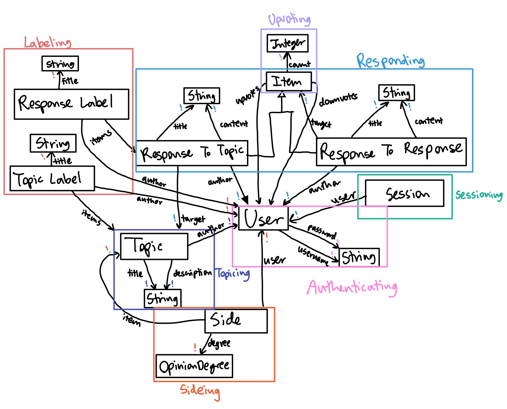

# Assignment 4: Backend Design
#### Collaboration Partners: Tiana Jiang, ChatGPT
## Abstract Data Models
**concept:** Responding [Author, Item]

<!-- **purpose:** share opinions on text, which allows for discussions and learning of different perspectives

**principle:** after a piece of text is posted, an opinion on the piece of text can be written and shared -->

**state:**

responses: set Response

title: responses -> one String

content: responses -> one String

author: responses -> one Author

target: responses -> one Item

<!-- **actions:** -->
<!-- 
```
createResponse(content: String, user: User, target: Target, out response: Response)
    make a new Response that corresponds to the title, text, the user who wrote the Response,
    the issue the response is for, and the side of the issue the response is arguing for.
    The default vote amount is 0.

deleteResponse(user: User, response: Resonse)
    delete the specified response made by the User. The user must have been the author of response before this.
```  -->

---

**concept:** Topicing [Author]

**state:**

topics: set Topic

author: topics -> one Author

title, description: topics -> one String

---

**concept:** Authenticating

**state:**

registered: set User

username, password: registered -> one String

---

**concept:** Sessioning-[User]

**state:**

active: set Session

user: active -> one User

---

**concept:** Sideing [Item, User]

**state:**

sides: set Side

degree: sides -> one OpinionDegree //*8 possible opinion degrees (strongly disagree, disagree, slightly disagree, neutral, slightly agree, agree, strongly agree, undecided) for every issue*

item: sides -> one Item

user: sides -> one User

---

**concept:** Labeling [Item]

**state:**

labels: set Label

author: labels -> one User

title: labels -> one String

items: labels -> set Item

---

**concept:** Upvoting [Item, User]

**state:**

upvotes, downvotes: Item -> set User

count: Item -> one Integer //*number of upvotes - downvotes*

### Data Model

{:width="600"}

#### App Definition
app  **POV**
- include Responding [Authenticating.User, Topicing.Topic] as RespondingToTopic
- include Responding [Authenticating.User, RespondingToTopic.Response + RespondingToResponse.Response] as RespondingToResponse
- include Topicing [Authenticating.User]
- include Authenticating
- include Sessioning-[Authenticating.User]
- include Sideing [Topicing.Topic, Authenticating.User]
- include Labeling [RespondingToTopic.Response] as ResponseLabeling
- include Labeling [Topicing.Topic] as TopicLabeling
- include Upvoting [RespondingToTopic.Response + RespondingToResponse.Response, Authenticating.User]

## Backend Code

[Link to github repo](https://github.com/jenkiim/6104-backend)

## Deployed Backend

[Link to deployed site](https://6104-backend.vercel.app)

## Design Reflection

When I first designed the degree-of-opinion scale, I set it from -10 to 10 to capture the intensity of users' opinions. But with 21 options, responses would get spread too thinly, especially on topics with fewer responses. To simplify, I switched to a set of eight categories: Strongly Disagree, Disagree, Slightly Disagree, Neutral, Slightly Agree, Agree, Strongly Agree, and Undecided. This still lets users have a range but keeps things manageable. I separated “Neutral” from “Undecided” since they mean different things: “Neutral” means indifferent, while “Undecided” reflects that someone hasn’t fully formed an opinion yet. This distinction allows users to show they’re still considering the issue, rather than simply not having a strong view. Futhermore, I decided to let users switch back to “Undecided” if they want, encouraging open-minded thinking.

When I got to implementing upvotes, I debated whether to allow upvoting on topics or just responses. Upvoting topics seemed like it might push only popular ones to the top, which could narrow down the diversity of views. Instead, I’m sorting topics by engagement, which showcases a variety of active topics without being heavily influenced by popularity. Still, users can upvote responses and responses-to-responses, which gives more detail to what people support and feel strongly about.

For labels, I originally thought about letting everyone create their own tags for topics and responses, but this would make it harder to filter out duplicates or overlapping terms. So now, users can use existing labels but can’t create duplicates, which keeps everything organized and easy to navigate. While it might feel restrictive, it ensures a clean, reliable system for tagging and filtering content.

## Collaboration Statement

I used ChatGPT to help me find what functions to use when reading from MongoDB to filter for sum and various fields. I also used it help my words flow better in the design reflection.

<!-- 
- response to topic
- response to response (two separate instances?)
- upvoting topics?
    - not allowing users to upvote topics, instead do sorting based on engagement
- description for topics? editing for topics? deleting for topics?
    - descriptions added for topics
    - not allowed to edit topics, so it can't just change
    - can delete topics
- users can go back to undecided after they decide
- no editing for labels or topics
- can only label topics and responses to topics
- can users go back to undecided after they decide? -> yes
- labels must be unique so people use other people's labels
- no editing for labels or topics
- can only label topics and responses to topics

- can only create tag when adding it to post? or just create tag? (chose can just create tag)

- data model diagram
    - can i reuse item for the target in responding concept and in upvotiing concept -->


<!-- todo:
- replace all errors with descriptive errors
- look for all places we want errors?
- check for validation like whether the person updating is the actual user making the change or deleting
- responses.ts -> reformat topics to be replaced with title?
    - copy format of responsesToTopic
    - think about why or when this would be helpful
- all get stuff should be formated
- repeated errors -> custom error
- add messages to all returns in routes
time:
- response formatting for response labels
- not be able to edit responses?? (said in design tradeoff for A3)

- do age for Authenticating?? -->


<!-- - if validator is related to the actual action, then put it in the concept (like validating that the user given is equal to author is not inside concpet??) -->

<!-- questions: -->
<!-- - diagram on how item is formatted?
- @Router.patch("/label/:label/add/response/:id")
    - throwing error for labeling a response that response doesn't exist but that response could be a response to a response, which could exist (how to customize errors) -> fine
- @Router.get("/topics/sort")
    - lots of casework? :(
    - issue with not showing topics that have no responses
    - handle inside of concept
-   @Router.get("/responses/topic/:topic/degree/:degree")
    - too much logic?
    - another generic error (one down) -> fine
- for errors, should i say that response [id] does not exist or the title?? bc title is not unique
    - for own testing
- typedoc comments??? -->

<!-- - delete responses if delete topic????????????
- make things refer to topicid????????????????

tests:
- when i create a side for a user for a topic, cannot create another one
- for all custom errors!!
- entering nothing for creating things
- updating or deleting when you're not the author for responses, topics, labels, etc.
- upvoting things with multiple users

- get responses logic

errors: -->
