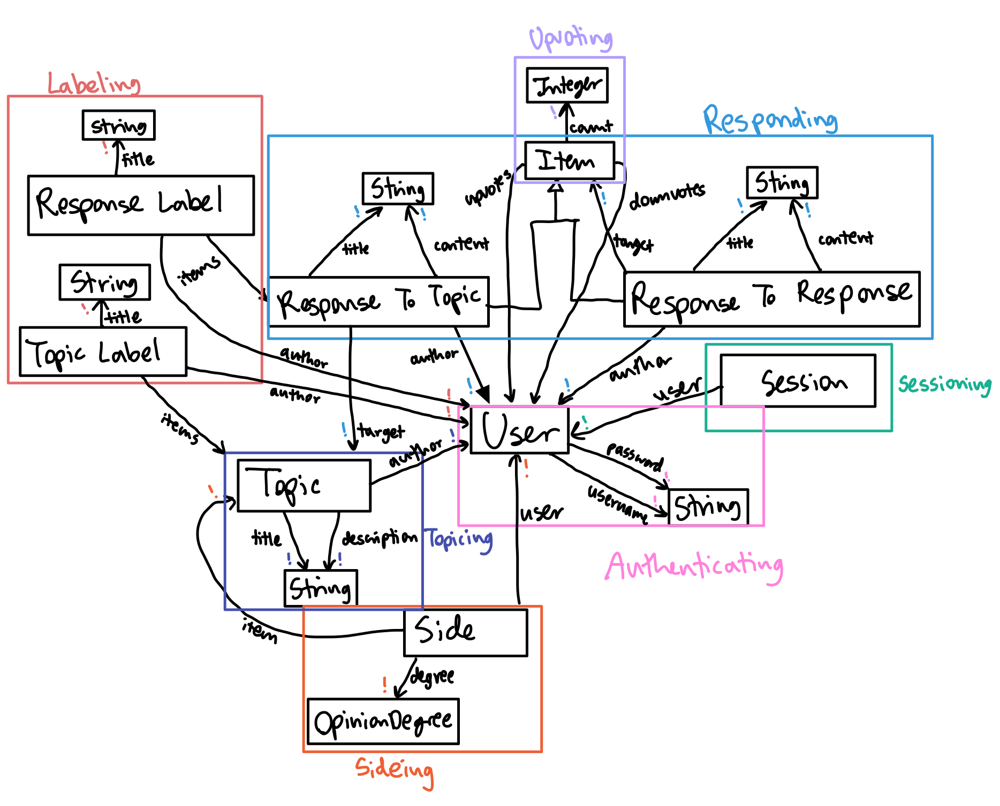

# Assignment 5: Frontend Design
#### Collaboration Partners: Tiana Jiang, ChatGPT
## Heuristic Evaluation
### Usability Criteria

**Discoverability:** The wireframes make it easy to add responses, suggest topics, and filter topics. However, it's unclear that users must click on the topic box to open its page. Furthermore, clicking on a response within the topic card redirects users to a separate page showing only that response and its comments, which could confuse users. A solution could be to limit the homepage to display only topics and add hover effects on the topic box to show it’s clickable. Then, within each topic page, responses and nested comments can be displayed together. This streamlines navigation but could reduce the amount of information on the homepage, making users take an extra step to find more content. Still, this makes it much more discoverable and easy to understand the platform.

**Accessibility:** The slider for filtering responses by opinion is challenging for users with motor impairments. Switching to a line with clickable dots, representing opinion degrees, could improve accessibility. Although this limits precision in filtering, it would make interaction easier and possibly lead to a more focused discussion. This is because if there are too many degrees of opinions, the amount of responses shown would be reduced across the board. This enhances both usability and discussion quality, but it does sacrifice some flexibility in expressing varied opinions.

### Physical Heuristics

**Fitt's Law:** Some buttons, like upvote/downvote arrows, are small and narrow, making them hard to click. Enlarging these buttons or adding clickable circles around them would increase clickability. However, this adjustment would need to balance with the surrounding text—potentially placing voting buttons below the response or using subtle icons to prevent clutter, especially because the text is what's most important. The tradeoff here involves balancing ease of interaction with a visually clean layout, prioritizing click efficiency without losing readability.

**Situational Context:** Currently, when a user opens a topic, they may find it unclear where they stand in relation to other opinions on the spectrum displayed. Adding a color-coded indicator or subtle highlight on the opinion line could enhance situational awareness, helping users see their stance in comparison to the range of responses. This visual cue would quickly orient the user within the discussion, making it easier to track their position relative to others, fostering a sense of context as they navigate opinions. A minor tradeoff is that it might add visual complexity, but the payoff in clarity would likely outweigh this, particularly as it aids in intuitive navigation across varying degrees of opinions.

### Linguistic Level

**Speak a user’s language:** The "Samples" page presents a variety of opinions on random topics, stripped of details like authorship to reduce bias. However, the term "Samples" doesn't clearly convey this purpose to new users. Options to improve clarity could include renaming it to something more descriptive, though this may clutter the sidebar. Alternatively, a short explanation could be displayed the first time a user logs in, but they might forget its meaning if they don’t frequently visit the page. Another approach could be adding a concise description directly on the "Samples" page itself, though it might be less efficient if users have to navigate there first. I think I will combine two options by having the name of the page on the menu sidebar to be more descriptive and have a longer description on the actual page.

**Consistency:** Icons like those for filtering, upvoting, downvoting, and profile access are consistent throughout the app and align with similar social media conventions. However, the comment icon on responses could cause confusion, as it’s unclear whether it leads to all comments on a post, opens a reply prompt, or both. Different apps use this icon in varying ways: Reddit’s version opens the comments page, while Twitter’s opens a reply prompt. To simplify, we could replace the comment icon with a “Reply” button and limit its appearance to topic pages. This way, it’s more intuitive for users to understand its purpose without needing extra clarification.

## Visual Design Study

<!-- {:width="600"} -->

## Frontend Code

[Link to github repo](https://github.com/jenkiim/6104-frontend)

## Deployed Frontend

[Link to deployed site](https://pov-2655im1n8-jenkiims-projects.vercel.app)

## Collaboration Statement

I used ChatGPT to figure out how to navigate users to go back to the page they were at before they navigated to the current page.