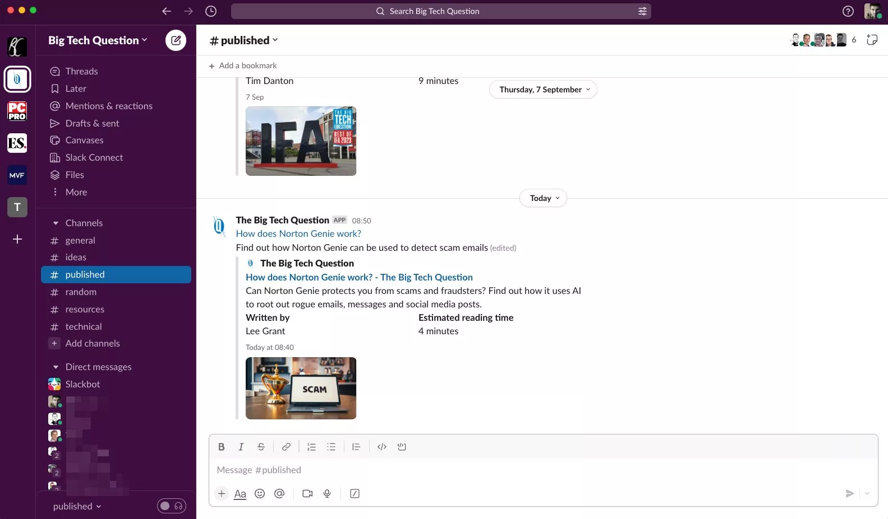
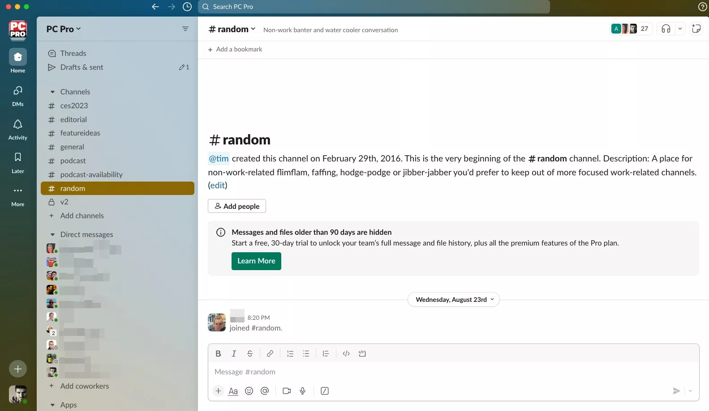
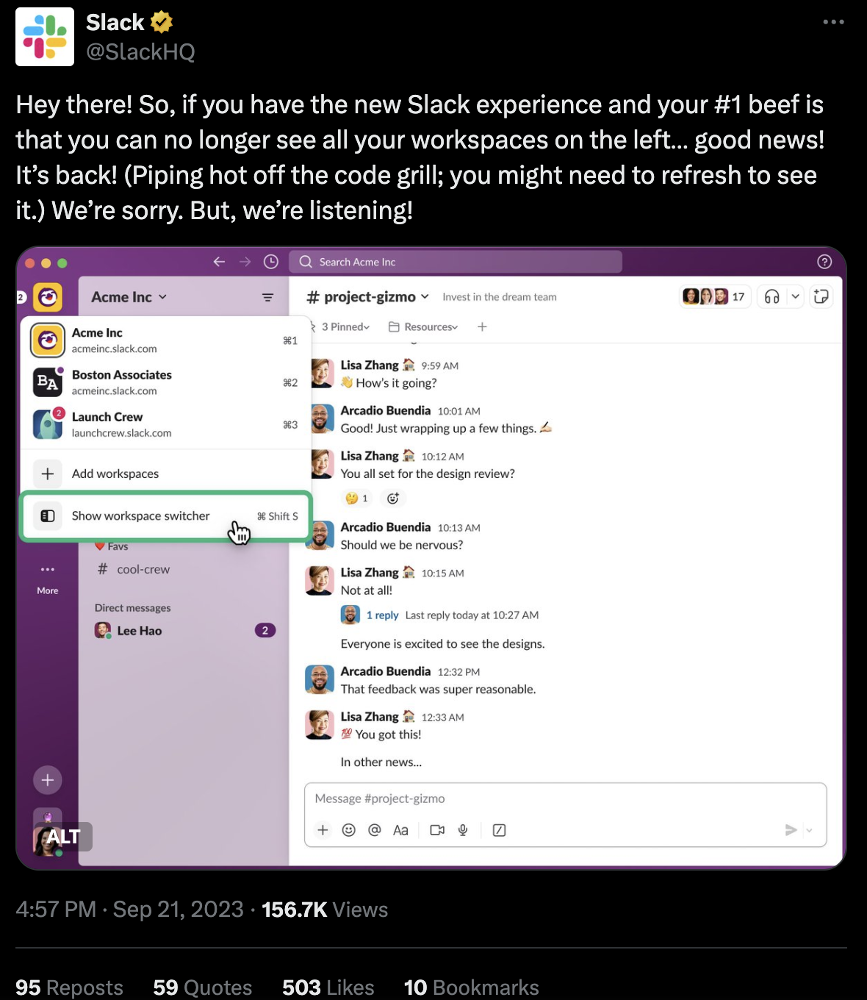
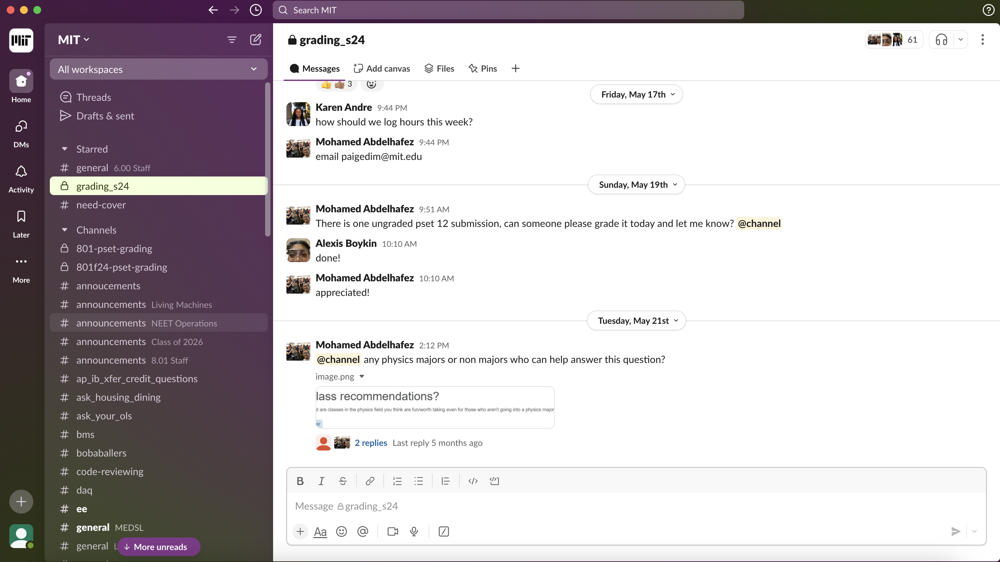

# Blog 1: Slack Redesign Issues
About a year ago, Slack made some big UI changes that created many issues. In this post, I’ll break down some of those changes and why they’ve been problematic.

The biggest resign that Slack did was change the sidebar menu. Before the UI change, each workspace would be very separate:

{:width="600"}

When there was a notification in a workspace, a little red alert would pop up right next to it. This setup made it easy for users to keep track of their different workspaces without confusion and allowed them to focus on various tasks simultaneously.

However, a year ago, Slack decided to simplify things by updating the sidebar menu, consolidating everything into fewer places to create a more straightforward experience.

{:width="600"}

For instance, the Activity page now shows all notifications across workspaces in one view. While this might seem convenient—having a single spot to check all notifications—it can also feel overwhelming to see a flood of alerts from different workspaces. Users have to think harder to associate each notification with its respective workspace.

Another major issue was that instead of displaying all workspaces individually on the sidebar, they were condensed into a single stack at the top of the menu bar. This change made switching between workspaces slower since users now had to click on this stack first and then select the workspace they wanted to access. Additionally, users could no longer visually see which workspaces had unread messages. They had to sift through the Activity tab, which doesn’t allow grouping notifications by workspace. Furthermore, it’s often easier to handle similar messages in one workspace at once, which this Activity tab didn't help with. People complained about this so much that Slack quickly allowed users to add back the sidebar menu with all of their workspaces:

{:width="600"}

On a positive note, I want to highlight something great that Slack did: they now allow users to customize the app's theme. This includes visual assistive colors for users with Tritanopia, Protanopia, and Deuteranopia. It’s fantastic to see Slack considering these visual challenges and offering users options to tailor their app experience. Below is the theme for Protanopia and Deuteranopia:

{:width="600"}

Overall, while Slack's redesign tried to make things simpler, some of the changes made it hard for people managing multiple workspaces. Merging notifications into one spot was meant to make things easier, but it actually added a bit of mental strain for users switching between tasks and channels. On the other hand, it's great that Slack listened to feedback and let users customize the sidebar again. Plus, their new color options for accessibility show that they prioritize making the app accessible for everyone.

[Source for Pictures](https://www.techfinitive.com/slack-new-design-can-you-go-back/#google_vignette
)
