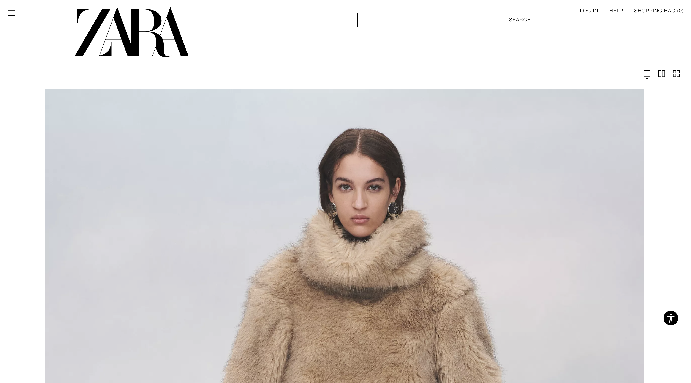
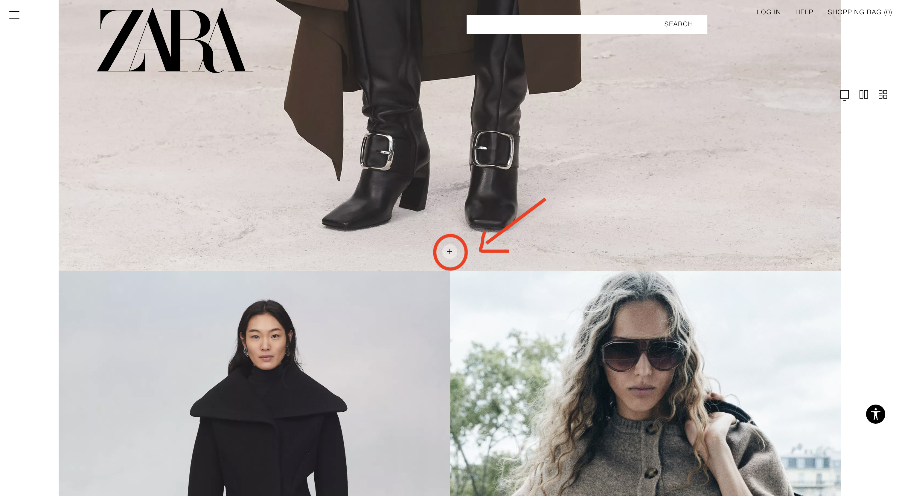

# Blog 2: Zara Visual Design Analysis

As a frequent shopper at Zara, I've always found their website to be visually overwhelming, and many of the issues seem to relate to fundamental visual design principles like the ones we discussed in class.

One positive aspect is that Zara’s website puts a clear emphasis on the clothing items. The white border surrounding the clothes (the left and right margins of the screen) helps bring the items into focus, creating a clean and minimalistic look. This aligns with the Gestalt principle of figure, where the highlighted clothing stands out against the less prominent background, directing the user's attention.

{:width="600"}

However, when you look deeper into the layout, it becomes clear that there are several problems. One of the main issues is that the images are so large that sometimes only one item is visible on the screen at a time. By only showing one or two large images per screen, the site makes it hard to browse, as users must scroll excessively to see more products.

{:width="600"}

Another problem is the lack of clarity in the product displays. For example, if a photo shows both a cardigan and a skirt (shown below on the right), it’s not immediately clear which item you’ll be taken to when you click the photo. There is no consistency. The mixed displays of multiple items within a single image create confusion, because there’s no uniform way to tell what clothing item the picture is supposed to highlight.

{:width="600"}

One of the biggest missed opportunities on Zara’s site is the lack of effective color use, particularly in functional elements. For example, the plus button at the bottom of clothing images lets users quickly add items to their cart—a helpful feature in theory. But this button is a pale white, often blending into the background, especially if the clothing or the page is also light-colored. This makes the button incredibly easy to miss. The decision to use such a subtle color likely contributes to the minimalist design of the website, but it does so at the cost of discoverability. Zara could improve usability significantly by changing the button color to something more eye-catching, ensuring that users can find and use it easily without sacrificing aesthetics.

{:width="600"}

I also discovered a grid view option that was somewhat hidden (part of the issue above). This layout does improve the experience slightly, as it shows multiple items at once and helps reduce the overwhelming scrolling. However, the grid still has its own issues. For one, there’s very little margin between items, making it feel cramped and overwhelming.

{:width="600"}

Lastly, the lack of visual consistency is highlighted by the variety of backgrounds in the product images. Some photos have simple, clean backdrops, while others have busy or distracting settings. This inconsistency draws users away from focusing on the clothes and instead become distracted by the uneven presentation.

[Source for Pictures](https://www.zara.com/us/en/woman-must-have-l4108.html?v1=2420954&regionGroupId=25
)
