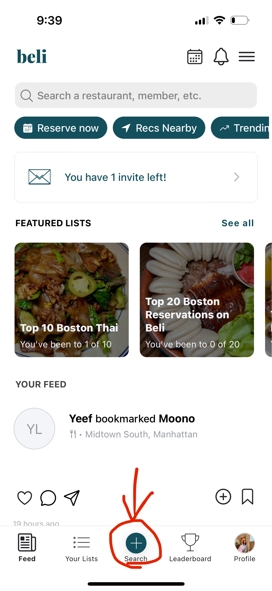
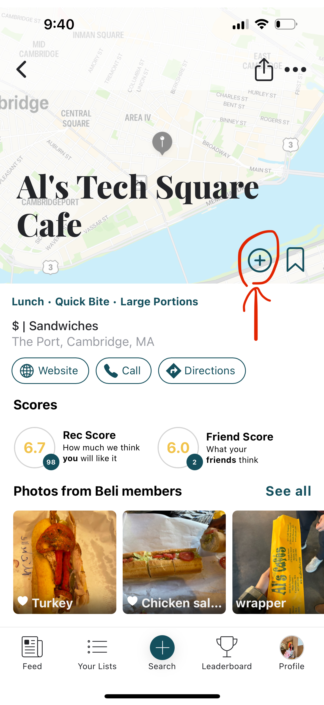
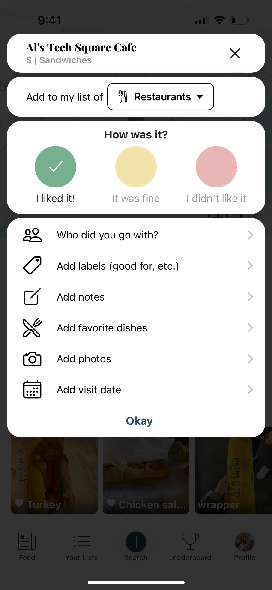
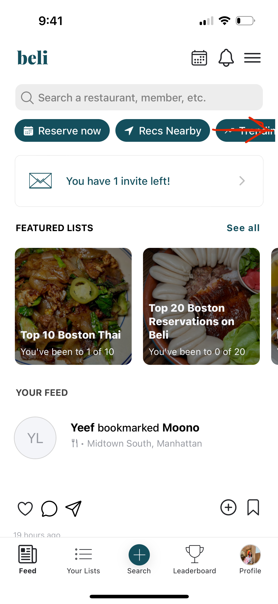
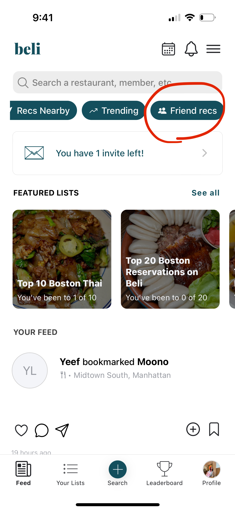
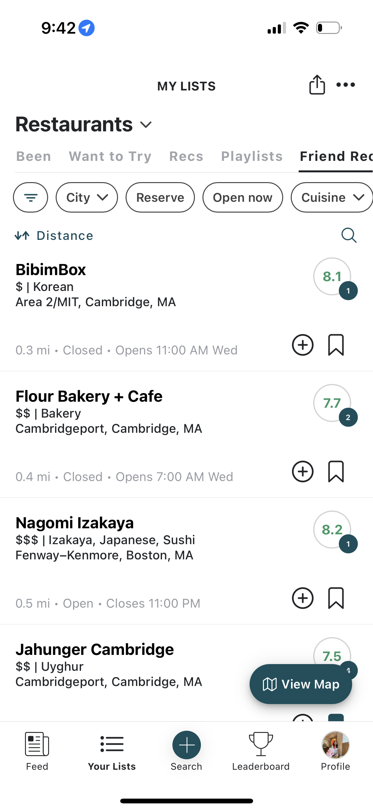

# Blog 3: Cognitive Walkthrough of Beli

Beli is a relatively new app that’s gaining popularity, but sometimes I find myself a little lost when using certain features. I’m going to walk through some of the confusing aspects of the app using the cognitive walkthrough framework we learned in class with the Bank of America ATM.

For this analysis, I’ll focus on adding a restaurant review, which is one of Beli's key features. One issue I ran into is that there’s no clear direction guiding users to add a review. There's a plus button at the bottom of the screen, which seems like it could be for adding a review, but it’s labeled “Search,” which threw me off. I get what Beli is trying to do here—allowing users to find a restaurant first and then leave a review—but the home screen already has a search bar, which leads to the same page as the plus button. Having multiple ways to find and review restaurants is efficient, but for first-time users, it’s confusing.

    

Once you search for a restaurant to review, you’re taken to the restaurant’s page. Again, it’s not obvious at first that pressing the plus button is the way to add your review. But after you figure that out, Beli actually does a great job guiding you through the rest of the review process. The instructions are clear, and it shows you how much more you can add to your review if you want to. After finishing the review, the app takes you to the ranking stage, which is also pretty easy to follow. Finally, Beli shows your review on the restaurant’s page, so it’s obvious that you’ve completed your goal.

    
    

Another feature I really like is the ability to see all the top recommendations from my friends in my area. However, this feature isn’t advertised well. I actually stumbled across it by accident while exploring the app. There are multiple ways to access it, but the easiest way is super hidden. If you look at the screenshot below, the "Friend Recs" filter is on the far right, but you have to scroll across the banner to even see it. This confused me. Still, I don't think there isn't a super clear way on how to fix this. They could reduce the number of filters to make everything visible, shorten the descriptions (which might confuse users), or use a dropdown (which would require an extra click). Each of these options comes with trade-offs.

    
    

Once you click on "Friend Recs," it becomes clearer that you’re now seeing your friends’ recommendations, as it's shown on the top tab. Additionally, each restaurant in this view has a dark circle with a number next to its rating, which represents how many of your friends have rated the restaurant. However, this isn’t immediately obvious, and there’s no clear indication that these ratings come specifically from my friends rather than all Beli users.

    

In conclusion, I really like Beli and use it for many things, but this cognitive walkthrough made me realize it has some odd design choices that could use improvement.
