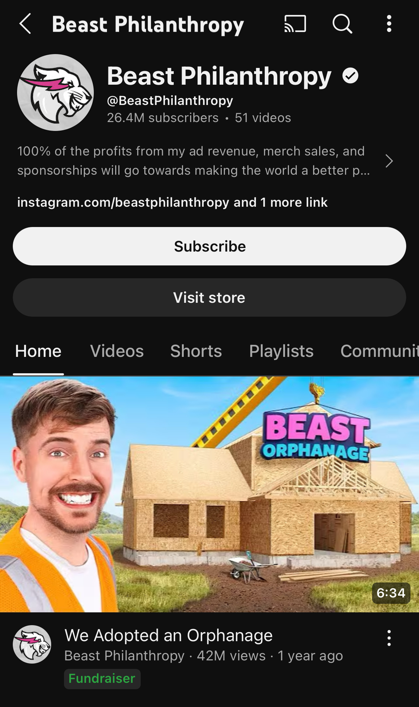
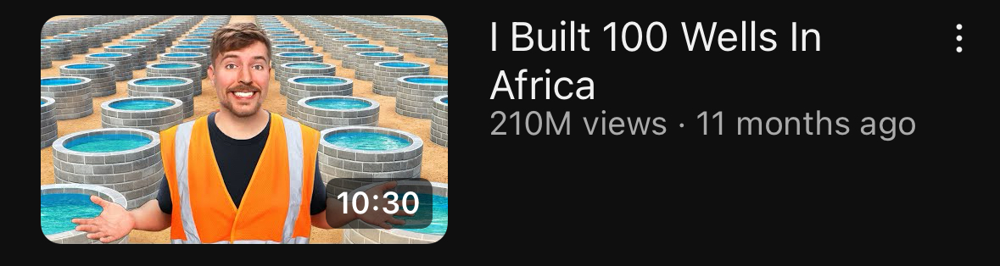
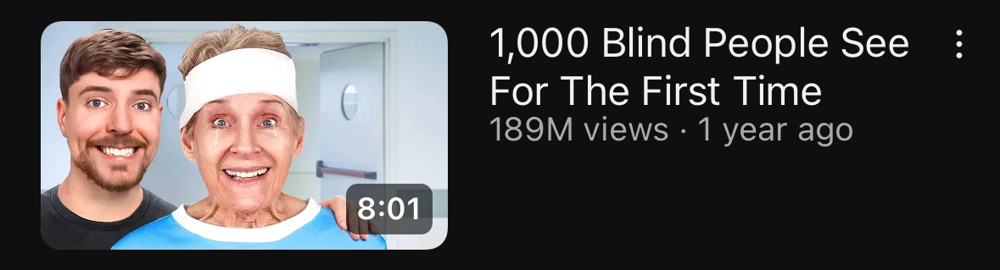

# Blog 4: Ethical Concerns of Mr. Beast's Philanthropy Videos

Lyel brought up a lot of interesting points that I really enjoyed learning about. When we discussed aligning business needs with doing good in society, I immediately thought of a very popular YouTuber who uses this approach: Mr. Beast, known for creating “stunt philanthropy” videos.

Mr. Beast gets millions of views, and his impact is undeniable, especially among younger people. His popularity isn’t just from extreme challenges but also from giving back to those in need. He often does this by offering big prize money to individuals who complete challenges, or by making philanthropy videos, like those on his “Mr. Beast Philanthropy” channel. A few of his videos, like helping "blind people see for the first time," have caused many discussions on the ethics of his videos.

    

The marketing strategy behind Mr. Beast’s philanthropy videos is very effective. By drawing in hundreds of millions of views, he generates ad revenue that, in turn, funds more videos and enables him to give even more back to society. This cycle creates a way for him to grow his platform while supporting more philanthropic projects. However, this same strategy has been met with a lot of criticsm.

    

For example, in one video filmed in Africa, Mr. Beast faced backlash for what some viewed as “white savior syndrome.” People have argued that his videos inadvertently perpetuate stereotypes, such as the idea that communities in Africa rely on external, Western aid, to millions of viewers. Furthermore, people highlighted the risk of exploiting serious issues for views, which, even unintentionally, can set a bad example.

    

Similarly, Mr. Beast’s video “helping blind people see for the first time” was meant to be inspiring, but some viewers felt it instead exploited people with disabilities to gain attention. The video also led many people to believe that blindness could easily be “cured,” potentially spreading misinformation. In fact, a blind advocate raised concerns in a video linked below about how misleading portrayals of disabilities can harm organizations that are actually working on research to cure blindness. This demonstrates how the simplified and almost gamified videos can harm society by hindering funding for actual solutions.

[Link to YouTube video metioned above](https://www.youtube.com/watch?v=nxI6lirO5K0)

Mr. Beast’s videos are controversial partly because they aim to be entertaining while showcasing real struggles. The success of his channel comes from these viral stories, which also fund his philanthropic activities. However, this approach also highlights the fine line between doing good and unintended consequences. Mr. Beast's motive may be to spread kindness, but it’s clear that there are complexities involved in creating content that also aims to educate and inspire without oversimplifying or misrepresenting important issues.

In the end, Mr. Beast’s efforts show the potential and the pitfalls of philanthropy in social media, and how aligning bussiness needs with doing good in society can cause harm if not done properly.
